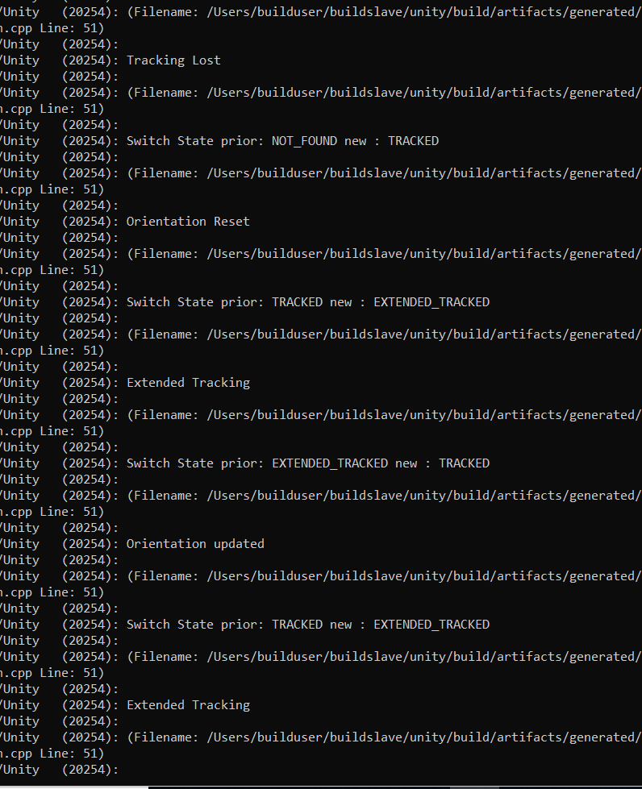
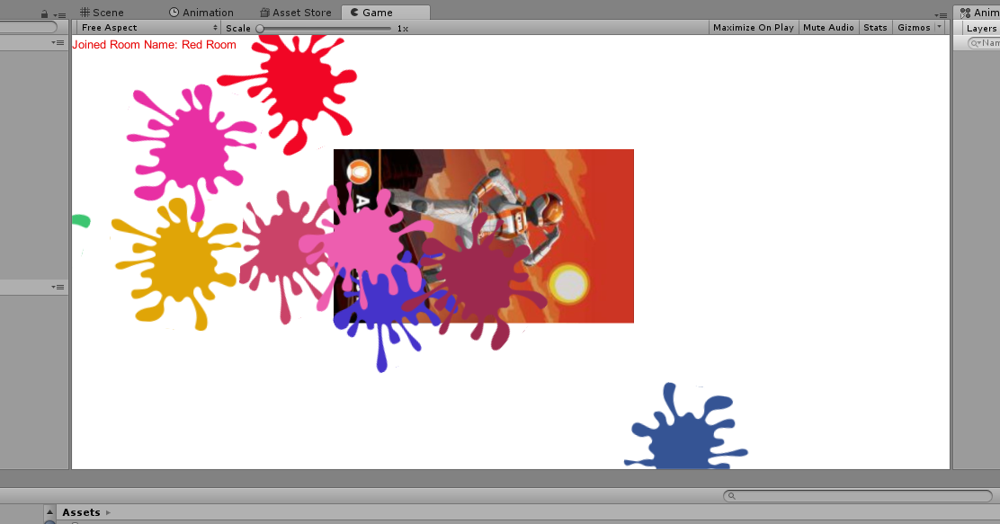
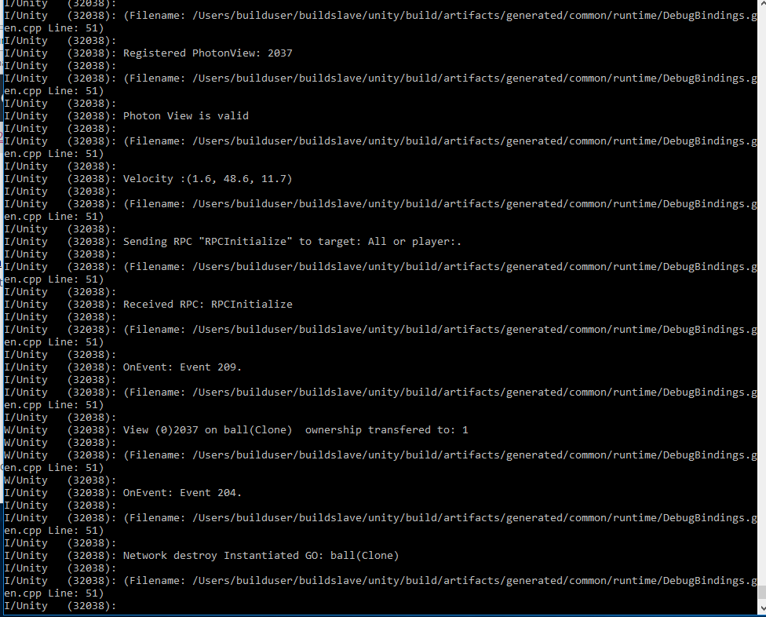

Here are some clues to how to get the cube orientation to be correct.
Start the device vertical when the phone. 

The transformation is correct as it stands.:

Part A--Getting the Cube to Rotate
----------------------------------

The first part getting the cube to rotate with the device works.  I was able to
transfer the mobile build to my kindle Fire and run it from the kindle.  That all
worked.  Some steps along the way were to first to create a room and then get the
mobile device to find the room.  Alot of that was getting the Android device to be a
development device and loading unity on it.  That is described below.  The next part
was to Get a given cube to rotate with the With kindle fire.  There was the transform
and the rotation matrix.  The change in rotation of the android device made it onto
the cube projected to the screen.
some experimentation, it turned out that the convention within the code was correct. 
There is a movie of this in the directory.  

Using an HDFire as a Android Device
-----------------------------------

The Java set up is as described in the environment set-up. Android studio needs to be
set up for each user on the computer so it should be installed for the user that is
doing the work, not for the administrator and not one install for all.  I have an
HDFIre 10.  The API version of this device is 5.1 or API version 22, so I built and
deployed to that version (unity player settings. In Android Studio I
updated all the components when prompted.  I did not install the virtual environment.
In the end in Android Studio the default project says synced successfully and it
build.  It is important not to install build tools for the latest version as that
causes Unity not to build (not sure why). In order to communicate with  an Amazon HD fire, one has
to follow Amazon's instructions on Connecting to Fire through Android Debug Bridge
(ADB).  One has to install a new USB driver.  One can then test whether the kindle

Here is the link:
https://developer.amazon.com/docs/fire-tablets/ft-set-up-your-kindle-fire-tablet-for-testing.html

communicates with the computer or not.  With a USB cable connected the serial number
should show up.  Through ADB, one can also turn off the USB
and send the application wirelessly through the network connection.  The USB transfer
is faster though.  On the device one should in Developer options Enable ADB, so the
kindle works for developers.  Once it is installed it needs to be stopped and
restarted. Hitting the square, one can stop the AP and hitting the AP, one can
uninstall.   Unity essentially calls the Android SDK so it only reports errors.
If successful during build, then you will see transfer APK to "serial number of
device.

ADB has nice tools for debugging that can be used.  
For example adb logcat -s Unity PackageManager dalvikvm DEBUG
With a USB cable connected this gives the debug log and unity errors.
adb logcat -c will clear the log.

Android studio can run and stop the apk file. This no longer works. The debug
messages are different when installed through Android studio.  I think not all the
necessary libraries are installed in my setup.  It is best to build and run through
unity. What I find useful
is to build the PC version as a stand alone and leave it running.  Build the Android
version and use Android Studio to run and stop the app. The adb logcat -s line shows
all the debug errors.

What I found critical was not to add Build Tools for the latest API version.  Gradle
would not compile to android then.  My HDFIRE uses the android API 22 so I built for
that version.  I uninstalled all build tools and compile and deploy worked. 

Also I think you can't deploy this without doing so with unity.  I think libraries
are also used in addition to the apk.  Every time I deployed successfully I did it in
Unity.

Part B  Using Vuforia, PUN and getting a SPLAT
----------------------------------------------

With the android connected, the debug log helped a great deal in figuring out what
was running on the android.  The first part was to get the images to register.

The first step was to get the target joined.  The same code from above worked here.

Next, the images had to be made large enough and had to track.  I made the images larger so that when the
mobile version ran on the PC, the target image filled up the frame.  Similarly for
the PC.  The provided image, for some reason, would not download to the mobile device
and I was getting an error-- image not found.  This I saw through the debug prompts. The Behaviour tracking status went
from unknown and would not trigger state changes.  I went back to my first version
and just added the network stuff and that was no different.  I changed the image to
Astronaut, made sure it filled up the scene.  I picked the astronaut because the
debug log said that image made it to the target. With that I was able to see on
Change Status go from track to untracked to extended.  Also the debug log stated the
image was found.

The extended mode in Vuforia analyses the current scene for landmarks and when they
are found, it uses  these visual landmarks as 3D reference points.  Here we want to
use the Gyroscope instead. Actually we are not interested in extended Track since
that uses visual landmarks from the environment.    What I did was in the beginning the target was untracked
and not in sync with the real world.
Once the two images could sync the mode became
tracked.  Then the Gyro was reset, which essentially set the reference location of
the ARCamera and the Gyro.  Now, with Pause false, each time the Gyro moved the
Camera AR tracked.  This never falls out of tracked status.

This is all done in TargetBehavior.cs, which is the Event Handler.  To understand
better the logic, I removed the DefaultEventHandler and put in the useful routines in
TargetBehaviour.cs.  This way there is only one loop for events.

The Track button will reset the visual tracking, allowing vuforia to align the images
and track again.  This is used for resetting in case the Gyro's accumulated errors
get too large.

The "Gyro Off Button" disables the Gyro update.  This is useful to stop all updates
and test if the Gyro is working.

Evidence that Tracking is working
----------------------------------

Vuforia's image tracking is working.  When the camera is not tracked and the image
fills up the screen the mode goes to tracked.  The Target then gets superimposed on
the screen.  As you tilt the HDFire, the target changes perspective always looking
like it is in the same location on the image.

The Gyro control is also working.  Once the mode goes to extended Tracked or
untracked the Gyro turns on and the target remains in position.  One can see that the
perspective stays locked on the target as the HD fire tilts forward and back.  After
some time, the target drifts.  This can be reset with the Track button.

To test once the Gyro starts, it can be shut off.  Now the Camera AR is not updated
at all, neither by Vuforia or by the Gyro.  The result is the target stays exactly
where it started on the screen.

Mobile Shooter 
---------------

Here the idea was to get the paint ball to fire and appear on the target.  THis is
working as evidence by the following images:

The main code that I touched was in MobileShooter.cs called ShootBall(Vector3
velocity).  I got the ARCamera position using the transform, and then I used that to
instantiate a ball using PhotonNetwork.Instantiate().  That function will create a
Ball that is launched and is visible over the network.  The ball itself has a
PhotonView object attached so that is the one to use to send the Remote Procedure
call over the network.  To get this to work, on the PaintBall_PC, I also attached a
PhotonView object.  

When the ShootFront Button gets hit, there were two callbacks
that could respond.  Mobile Shooter.cs had registered that event, and also
TargetBehavior has that button.  Since only one needs to work, In Target Behaviour,
that button does not register a call back.

This did not work well for a long time.  It turned out that if one calls the
photonview on the ball, that was not null.  I thought it may be that Photon can't
handle Vector3 of Unity; I wrote and registered a script called TransferVector3.
That turns the vector3 into bytes to be transported.  Then, in the RPC, I used the call 
photonView.RPC("RPCINitialize", PhotonTargets.All, velocity, color_v).  This worked.
The debug log shows the velocity, that RPC is initialized, that the ownwership is
transferred to the master.  Also when balls are launched, they appear cloned on the
PC as objects. Prior to photonView being attached properly, the balls were visible
but they had no velocity and no color and did not approach the target correctly.
Actually if one just launched RPCInitialize on the ball, from the mobile perspective
the balls Launch correctly, They just never collided with the PC board.

Evidence that the Shooter is working.
-------------------------------------

The balls get launched with a velocity and a color.  The debug log also indicates
that the balls have a velocity.  Once they hit the board, they actually splatter.
One can get them to splatter both by hitting the front shoot button and also by
swiping ones finger in the direction of the arrow.  The evidence is that it is easy
to see splats on the PC.

If one keeps the target on the image in "Track Mode" as the angle of the HD fire
changes the Balls move across the screen appropriately:  for a range of angles the
balls splat, and beyond that they miss the edges of the board.  The swipe also works
well.  First line up the target and get it tracked then rotate the device so the
arrow faces the canvas-- one will see that one gets splats that either hit or nearly
miss depending on the rotation angle.

Further Developments
--------------------

I changed the way that the gyro updates orientation.  I was looking for a way to get
the internal sensors to better predict the position of the camera, so that when the
gyro tracked, the target was stable.  Instead of using gyro.attitude,
as we did for the first two parts, I used gyro.rotationRateUnbiased.  The code is
currently in Gyrocontroller.cs and it goes as follows:

  Vector3 angularRate = ConvertRotation(gyro.rotationRateUnbiased);
    	    Quaternion update = Quaternion.AngleAxis(-Time.deltaTime *
	    angularRate.magnitude * Mathf.Rad2Deg , angularRate);
	    // for part1 and 2 uncomment out this line and the controlled object gets
	    // updated using gyro.attitude.  As it stands the update function uses
	    // the angularRateUnbiased function to get an improved measure of the
	    // rotation rate.
             //controlledObject.transform.rotation = qRefObject * deltaR;
            controlledObject.transform.rotation =  controlledObject.transform.rotation * update;
          //   UpdateDynamics();
           // UpdatePositionVelocity();
            //rb.AddForce(gyro.userAcceleration * thrust);
        }
    }
 

 The angularRate line converts the rotation vector (omega) into the right handed
 coordinates of unity.  The change in sign of z represents the right /left
 conversion.  The next line creates a quaternion out of this.  The negative
 sign for w is necessary, because a rotation in a left handed coordinate
 system would be a negative rotation about the same axis in a right handed one.  This
 conversion is also in the first convert angle function for
 quaternions. 

 There are two advantages to this approach.  Gyro.rotationRateUnbiased seems to
 correct for drift in attitude.  Second, we can get the change in orientation, here
 update from frame to frame. There is no need to store qRefGyro and qRefObject.
 Rather each update post multiplies and transforms the current rotation.  It is also
 less code and is easier to understand.

 This improved the tracking.  I tried this with the cube first and the rotation of
 the tablet always changes the cube in a predictable fashion. One can rotate the
 tablet fast too and the image always corresponds.  Back now in paint, and this
 helped stabilize the target image when the gyro sets the orientation.  now the image
 is much more stable than when using gyro.attitude.

 Adding Position
 ---------------

 I wrote code to  update the controlled objects position.  There is a field
 gyro.userAcceleration and that is meant to remove gravity and get the current
 acceleration due to movement of the kindle.  I tried to integrate this to get an
 updated position.  What I did was use Runge Kutta 2 to update the velocity and then
 estimate the change in position.  I used the userAcceleration as the acceleration.  
 Because the velocity and position can drift wildly,  I added a
 button to the gyro (Reset Orientation) that is there in mobile cube, that reset the
 position and velocity.  

 I found that the cube drifted.  I tried accelerating the cube in one direction to
 see if I could get the cube to move in that direction.  I would go back and forth
 say in the x direction,  The x velocity instead of oscillating, kept growing in the
 same direction.  I tried having the kindle stop abruptly in one direction, and that
 should have led to an appropriate change in acceleration but it did not correspond.
 
 Instead of integrating twice, I also tried monitoring the velocity to see whether
 large accelerations produced appropriate velocity changes.  That did not work.

 If one notices, the userAcceleration changes with orientation.  I think that the
 accelerometer is more geared to measure gravity's direction (which it does well) as
 opposed to being accurate enough to account for small changes in position. 
 It tended to drift in the direction of gravity.
 The code is written but was commented out.
